# ぼぎだぢの世界

ゲーム「ぼぎだぢ」の世界を、読者向けにまとめたページです。作者の設定資料(`docs/bogidachi.md`)から抜き出しています。この作品では作者の言葉が正典なので、なるべく作者の言葉のまま載せ、AI の説明は最小限にしています。

後半には、ゲームの中では明かさない設定も、折りたたんで載せています。

---

## あらすじ

> 偶然と手違いが積み重なり、時空連続体の泡として投下された超現実爆弾は、事象の蓋然性を攪乱する。
> やがて世界は静まり、人が遠くに去ったあとの時代。
> 自助努力と交雑した民芸品や玩具達が、囁いたり、徘徊したりする物語。

## アフターマンエイジ

人が去ったあとの時代を、「アフターマンエイジ」と呼びます。作者の言葉です。

> アフターマンエイジは大きな戦いの後の傷を負った世界。人間は去ったが、ぼぎだぢはちゃんの残滓として、わけもわからずに戦争を継続しているが、明確に敵がいるわけでもない。ぼぎだぢは習慣づけとして、人間たちがやっていたことをまねているだけ。ただ、あまり戦争色を出さなくてもいい。戦争の破壊からときがたっており、自然はたくましく復興していて、のどかな世界がベースで。さらに超現実爆弾の影響で、惑星混交や理不尽で奇妙なものがごちゃまぜになっている

月は破壊されて欠け、破片の輪をまとっています。その影響で地軸が曲がり、気象が変わりました。南極ではバナナが実ります。ゲームの中では説明せず、絵で暗示します。

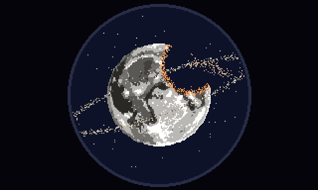

*望遠鏡でのぞいた月。月面を吹き飛ばす大爆発の跡と、破片の輪。*

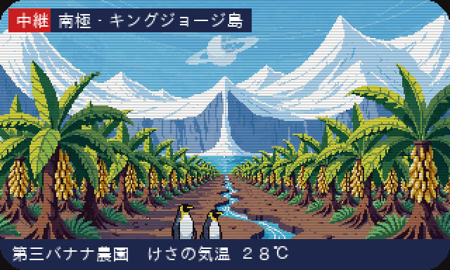

*テレビの中継。「南極・キングジョージ島／第三バナナ農園 けさの気温 28℃」。*

## ぼぎだぢ

- **ぼぎ**: 人が遠くに去ったあとの時代を徘徊する、主に動物を模した器物。または、「ちゃん」と一次接触した古いぼぎ。
- **ぼぎだぢ**: ぼぎを含む、器物の総称。
- **ちゃん**: 人間。

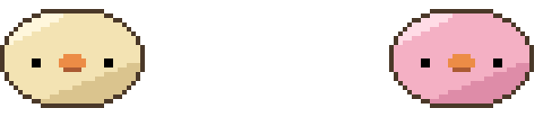

*きー(左)とぴー(右)。*

**きー**は、この物語の主人公です。

> 最古のぼぎ。「ちゃん」と別れ、生老病死と万物流転の意味を理解するが、忘失。ただ一つ記憶している「ださいおさむん」を探しながら世界を徘徊するが、やがて、目的からも衝動からも解放され、あるがままを感じる事に勤めだす。

見た目は、作者いわく「つぶれた饅頭のような形。正面から見ても横から見ても楕円。手足はない。耳はない。鼻の穴はない。目は鼻と同じ高さの、真っ黒な点」。

**ぴー**も最古のぼぎで、「きーの邪魔をすることに執着する。別名、悪魔」。きーと同じ形の色違い(ピンク)です。

ほかにも、たくさんのぼぎだぢがいます。

- **きこり**: 最古のぼぎ。リモコンの豚。動きが素早く、気まぐれ。
- **ちりん**: 最古のぼぎ。割れた所を漆で金継ぎされた風鈴。きこりに執着する。
- **ききこり**: 最古のぼぎ。電動の豚。自分の大きさに執着する。
- **ごろん**: 最古のぼぎ。ピギーバンク。
- **鉄瓶**: 怒れる南部鉄器。
- **マトリョーシカ**: 交戦的。
- **とりぼぎかー**: アヒルの頭がついた木製の手押し車型ぼぎだぢ。丸いタライ状の荷台に、卵型の乗客を乗せている。

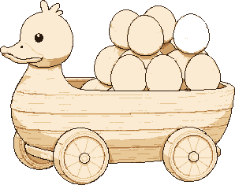

## 懲罰空間と断片

ゲームは「懲罰空間」から始まります。何もない、白い空間です。

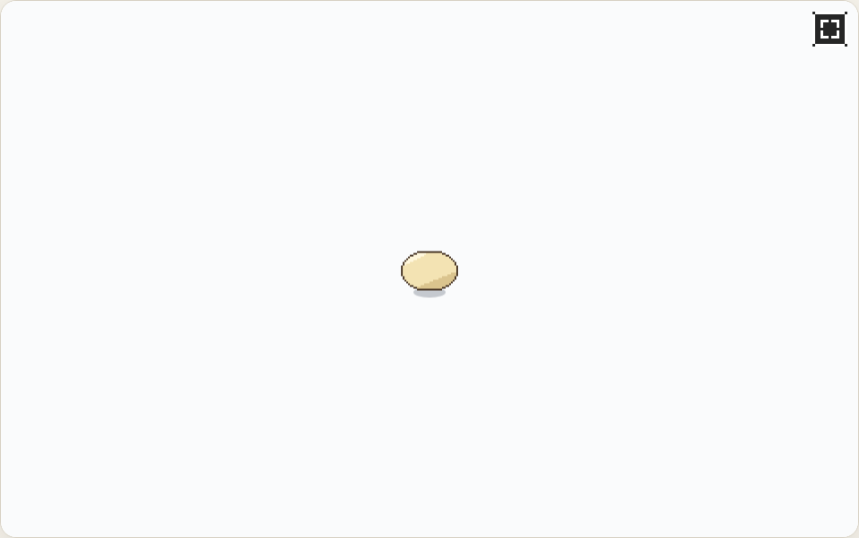

歩いていくと、台座に置かれた小さな模型が見えてきます。これが世界の「断片」です。断片に触れると、きーの記憶の世界や、混交した惑星などの別の世界に入ります。別の世界を探索して、何かの条件を満たすと、懲罰空間に帰ってきます。それぞれの世界には、次の世界へのカギになる道具や言葉があります。

言葉は少なく、説明はしません。きーはあまり話さず、意味のわからない固有名詞(「ちゃん」「ほうとう」)をつぶやくだけです。意味は、絵と体験で少しずつわかるようにしています。

いまできている断片は 3 つです。

### 凍った湖と富士山

きーが見た風景です。雪の峠道を下り、凍った湖のほとりのほうとう屋にたどりつきます。**ほうとう**は、きーが凍った湖と富士山を見たあとに食べた食事です。

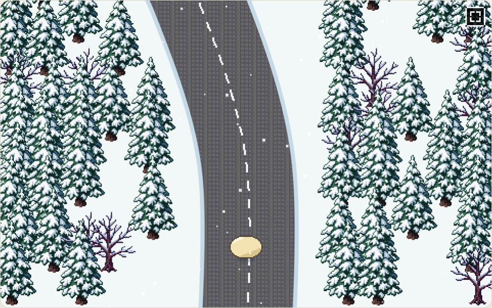

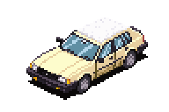

### アンバリッド・ホテル

高原の廃兵院(傷痍軍人の療養所)です。ぼぎだぢは、ここを「Hi Hey Win！」という音で認識しています(廃兵院とハイ・ヘイ・ウィンの言葉遊び)。ゲームの中では「廃兵院」という言葉は一切出さず、プレイヤーに言葉遊びで気づいてもらいます。施設の名前は「国立アンバリッド・ホテル」(アンバリッドはパリの廃兵院)。住む人は「入居者」と呼び、「患者」とは呼びません。

作者の言葉では、「廃兵院にも死人はいる」「超現実爆弾が炸裂した後も、廃兵院には傷痍軍人がしばらく穏やかに暮らしていた。民芸品や玩具を手すさびで作っていた。死人とぼぎだぢは仲が良い」。

手ざわりは「物悲しいが怖くない。リリカルな世界。サナトリウムのような穏やかな世界」。ただ、激戦があったことを匂わせます。

フィールドは今(秋の夕方)、一枚絵は生きていた頃(文化祭の日)です。今の人は、温かい灰色の半透明の影で描き、車椅子や楽器などの物だけが実体のまま残っています。

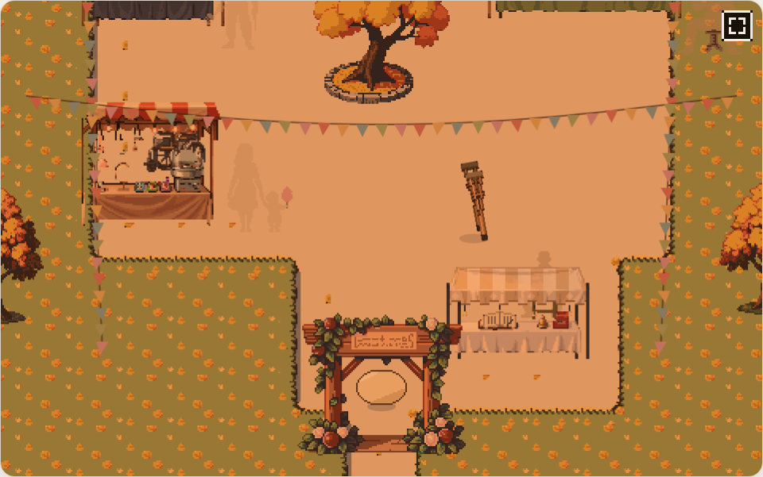

*今の中庭。人は消えて、物だけが残っている。*

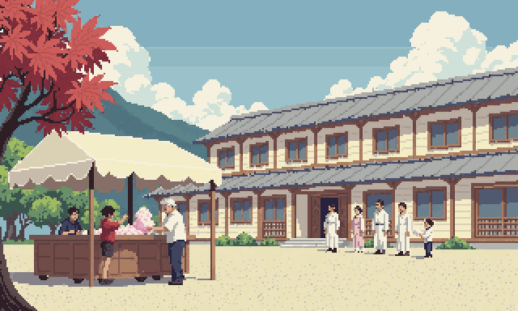

*思い出の一枚絵。文化祭の日。*

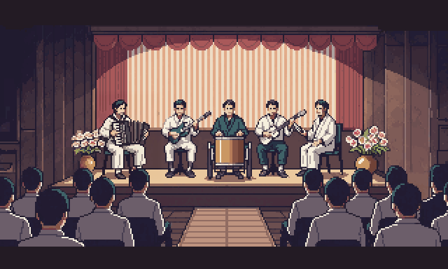

### 霞ヶ浦のエクラノプラン

霞ヶ浦の、かつての海軍航空基地の跡です。湖に、錆びた巨大なエクラノプラン(船と飛行機の中間の乗り物)が停泊しています。時がたち、自然に呑まれかけた、のどかな湖畔です。

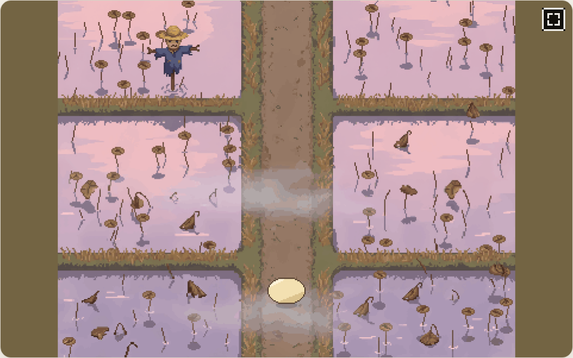

エクラノプランのコックピットには、**ミイラさま**が座っています。

> 霞ヶ浦に停泊する戦闘エクラノプランのコックピットに座っている死体。ぼぎを乗せて、遊覧飛行をしてくれる。

ミイラさまは、高高度対応のパイロットスーツを着た死体です。話しかけると、ロシア語で「Здравствуй, маленький друг! Хочешь совершить прогулочный полёт?」(こんにちは、小さな友だち。遊覧飛行をするかい?)と聞いてきます。

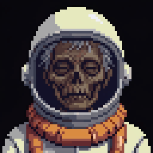

機体のまわりでは、**地上ぼぎクルー**が今朝も整備をしています。古い命令に従い、いまもぼぎボマーを整備している、笹野一刀彫(山形の木彫りの民芸品)です。きーは、ここで彼らからジャンプを習います。

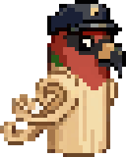

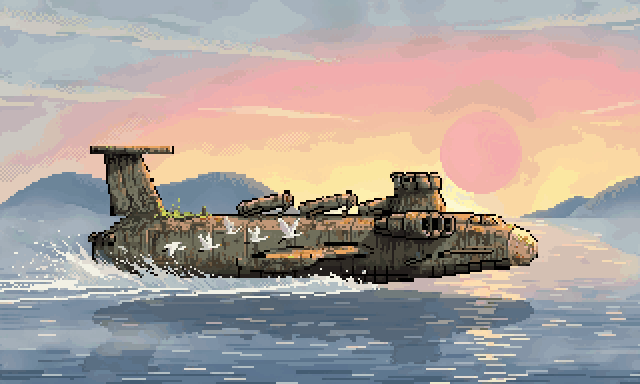

*遊覧飛行。*

## ことばの手帖

設定資料の用語から、いくつか。

- **ださいおさむん**: ちゃんが「きー」に言い残した言葉。
- **ぼぎカー**: 「きー」の車。ナイロンの戸板用ベアリングをタイヤに持つ。柿渋が塗られており臭い。光速度と慣性に制限を受けない。
- **車箪笥**: 「みとん」の家であり乗物。ヘミ V8 スーパーチャージャーをスワップされている。燃費が悪いが、ガソリンがなくてもみとんが望めば走行する。
- **おばけ**: 形而アップダウンクイズの過程で露出した物自体が、ぼぎに認識された姿。ぼぎとは仲が良い。
- **リンガボガー (Lingua boga)**: ぼぎだちとのコミュニケーションに使われる言葉、ゼスチャー、儀式。
- **ルチ将軍**: 知能指数 1300 の人形。まだドロドロして形をなしていなかった、きーの心に植えつけられたトラウマ。
- **鈴木商店**: 荒川区にある宇宙船殻用単結晶の製造販売卸元。超現実爆弾が招いた、現実には存在しない会社の看板。
- **南極**: 気候も日照も意味を問われなくなったので、やる気のある植物が繁茂している。
- **呪いの野犬**: フリーウェイにのさばる荒くれぼぎだぢのチーム名。
- **アリ・カカウロ**: 魔法のロバの口と尻の穴から砂金を吐き出させる呪文。
- **青い光漁(チェレンコフ光)**: ぼぎが炉心内部の燃料ペレットをもて遊び、海に投げ込んだ事件。
- **ぱーでれ**: ぼぎを捕まえる機械。ぱーでれに連れ去られたぼぎは戻ってこない。
- **宝舟**: 未踏海域を調査するために、ぼぎが片手間でつくった木造船。
- **まろうど**: アフターマンエイジのさざ波。実体化した三人称。
- **バナナ農園**: ぼぎのテレビ企画。
- **ぼぎボマー**: 古い命令に従い、いまだに爆装して飛び立つ無人機。どこかに爆弾を投棄して、基地に戻ってくる。

---

## ここから先はネタバレ

ゲームの中では明かさない(または、気づく人だけが気づけばよい)設定です。開発の記録として載せています。

エクラノプランとミイラさまの秘密

海面すれすれを飛ぶエクラノプランのパイロットが、なぜ高高度用の気密服を着ているのか。作者の言葉です。

> エクラノプランにみえるが、じつは宇宙船ということ。これは気が付く人がいればいいので、明示しなくていい。

ミイラさまのこと。

> エクラノプランのミイラ様は主エンジンが損傷しもう軌道には戻れないことを悟って失意の中で死んだが、ときどき来訪するぼぎだぢをのせて、健在だったサブスラスターで湖面をすべるように遊覧飛行をすることを楽しんでいる。もちろん、エクラノプランはすべて壊れているが、ミイラ様の思い込みが軌道にもどれないとなっているため、高く舞い上がれない。地上ぼぎくるーたちは、エクラノプランを修理しているが、ミイラ様はぼぎだぢに直せると思っていないので、いつまでもエクラノプランは壊れたまま。

地上ぼぎクルーの正体。

> 地上クルーは人間。その手にはおたかぽっぽを持っている。つまり、地上ぼぎくるーは地上クルーが所有していた民芸品がうごきだしたものだ。

懲罰空間の正体(物語の最大のネタバレ)

懲罰空間は、月の裏側にある「ださいおさむん」そのものです。何もない空間に見えますが、実際には、ちゃんが最後に言い残した場所です。ぼぎだぢは、探している「ださいおさむん」に、ゲームの最初からずっといます。

「ださいおさむん」は、Darkside of the Moon(月の裏側)。

このことは、すべての断片を見つけ終えた直後、物語の終盤で明かす予定です。見せ方はまだ決まっていません。

